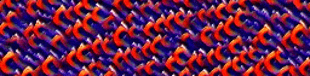

# :brain: Text-2-Cellular Automata

Using Neural Cellular Automata + OpenAI CLIP
(Work in progress)

### Examples
1. Text Prompt: Cthulu is watching

https://user-images.githubusercontent.com/57221122/147845469-fb24813f-cd91-45c3-918e-40e85146b2e1.mp4

2. Text Prompt: Vaporwave Art

https://user-images.githubusercontent.com/57221122/147845473-2b345d87-348d-4cac-9987-d42b69bd4336.mp4

3. Text Prompt: Starry Night

https://user-images.githubusercontent.com/57221122/147845575-e8d4d808-78b7-4de4-92aa-34905412b597.mp4

4. Text Prompt: Fish Underwater

https://user-images.githubusercontent.com/57221122/147845577-620e0142-04a6-4530-b424-61e6dcc0648f.mp4

